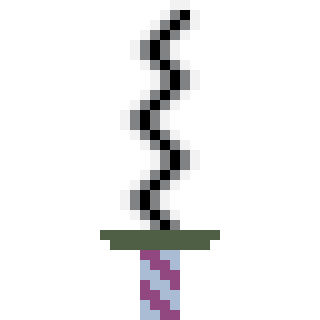

# Custom-Mouse-Cursors
Mouse cursors created using Aseprite. The repository includes cursors in formats .cur and .ani

# Setup a custom cursor

## Step 1
- Download the cursor(s) you want to use
- Navigate to C:\Windows\Cursors
- Drop cursor files into the directory
(Without this cursors will reset on machine shutdown)

## Step 2
- Open settings and navigate to (Mouse -> Additional Mouse Settings)
- Select the pointers tab, click on the cursor you want to replace, press browse and select the cursor you want to use (the cursor you added to C:\Windows\Cursors)
- Once all cursors have been set, you can press save as to create a 'scheme' (cursor preset)

# Cursor Preview

## Iguro Obanai - Demon Slayer

| | | |
|:-------------------------:|:-------------------------:|:-------------------------:|
|  Caret |   Pointer variation 1 | Pointer variation 2|
| Pointer variation 3 |   Pointer variation 4| Link Pointer|
| Loading/waiting cursor variation 1 |   Loading/waiting cursor variation 2 |

## Pig

## Simplistic

## Clown ('Pig' variation)

## Other
