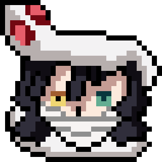
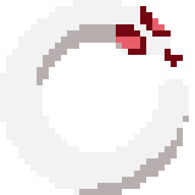

# Custom-Mouse-Cursors
Mouse cursors created using Aseprite. The repository includes cursors in formats .cur and .ani

# Setup a custom cursor

## Step 1
- Download the cursor(s) you want to use
- Navigate to C:\Windows\Cursors
- Drop cursor files into the directory
(Without this cursors will reset on machine shutdown)

## Step 2
- Open settings and navigate to (Mouse -> Additional Mouse Settings)
- Select the pointers tab, click on the cursor you want to replace, press browse and select the cursor you want to use (the cursor you added to C:\Windows\Cursors)
- Once all cursors have been set, you can press save as to create a 'scheme' (cursor preset)

# Cursor Preview

## Iguro Obanai - Demon Slayer

| | | |
|:-------------------------:|:-------------------------:|:-------------------------:|
|  Caret |  Pointer variation 1 |  Pointer variation 2 |
|  Pointer variation 3 |  Pointer variation 4 |  Link Pointer |
| Loading/waiting cursor variation 1 |   Loading/waiting cursor variation 2 |

## Piggy Pointer
| | | |
|:-------------------------:|:-------------------------:|:-------------------------:|
|   Caret variation 1 |  Caret variation 2 |  Pointer |
|  Link Pointer variation 1 |  Link Pointer variation 2 |

## Simplistic (Alpha Channel set to 123)
| | | |
|:-------------------------:|:-------------------------:|:-------------------------:|
|  Caret blue |   Caret white |  Pointer blue |
|  Pointer white |   Link Pointer blue |   Link Pointer white | 

## Clown ('Pig' variation)
| | | |
|:-------------------------:|:-------------------------:|:-------------------------:|
|  Caret |   Pointer |  Link Pointer |

## Other
| | | |
|:-------------------------:|:-------------------------:|:-------------------------:|
| Pointer Crosshair |   Link Pointer crosshair |  Link Pointer triangle variation 1 |
|  Link Pointer triangle variation 2 |   Pointer square|